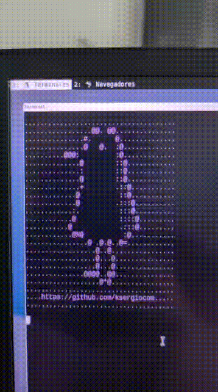

# curl yo.ksergio.com

Esto es un clon inspirado de parrot.live

## Como usar

- Necesario tener node instalado
- Hacer **npm init -y** y **npm i express**
- Ajustar **curl_yo.service** y enchufarlo a **/etc/systemd/system/...** y hacer systemctl daemon-reload y levantar el servicio
- Ajustar la configuracion de nginx para hacer de reverse proxy al servidor y reiniciar nginx